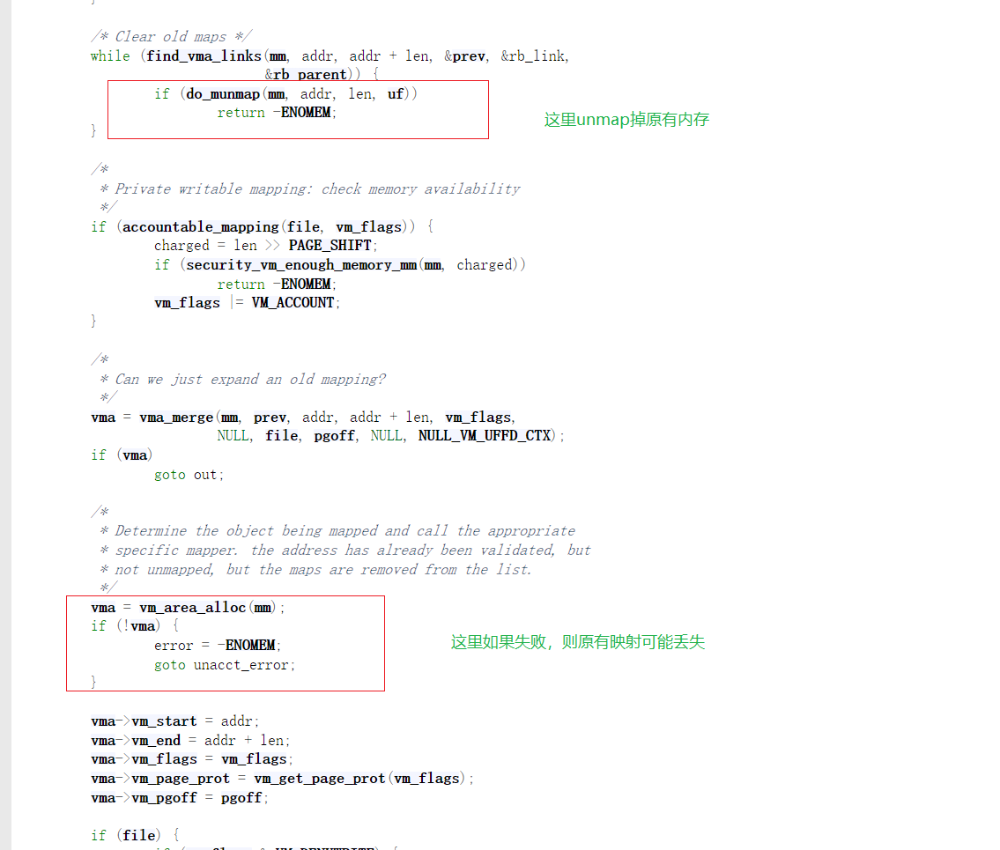
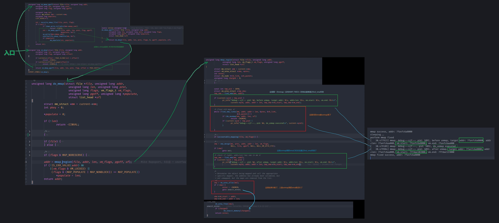
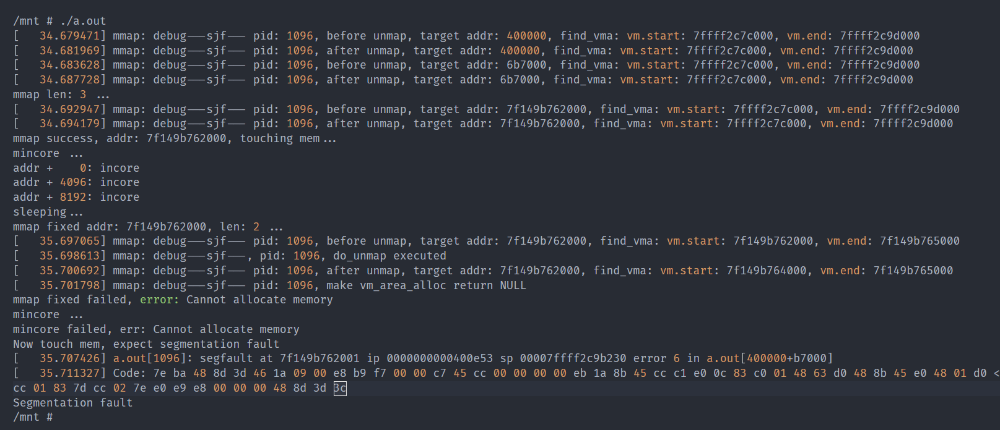

# MMAP_FIXED失败导致vma丢失

mmap的时候，如果指定了MMAP_FIXED，如`mmap(addr, len, prot, MAP_FIXED, ...)`，那么会先解除掉原有映射，然后再建立新的映射。那么在原有的映射已经解除了之后，如果系统处于低内存状态，则可能导致后续分配新vma失败。这时mmap会丢失原有的（已经被解除的）映射，造成原有内存区域状态已经无效。

注：根据[POSIX2017对mmap的描述](https://pubs.opengroup.org/onlinepubs/9699919799/functions/mmap.html)，如果mmap在 *非* `EBADF/EINVAL/ENOTSUP` 错误码的情况下失败，那么是允许`[addr, addr+len)`的部分或全部内存被unmap掉的，因此这里并不是kernel的错误，只是一个现象。

以下分析来自于内核版本 *5.0.1*，仅供参考。

## 太长不看版

[mm/mmap.c:mmap_region函数](https://elixir.bootlin.com/linux/v5.0.1/source/mm/mmap.c#L1701)

1. 会首先[解除旧的映射(如果存在)](https://elixir.bootlin.com/linux/v5.0.1/source/mm/mmap.c#L1729) `if (do_munmap(mm, addr, len, uf))`
2. 然后，如果可能，[扩展旧的vma](https://elixir.bootlin.com/linux/v5.0.1/source/mm/mmap.c#L1746)
3. 否则，[分配新的vma](https://elixir.bootlin.com/linux/v5.0.1/source/mm/mmap.c#L1756)

在第三步分配新vma的时候，如果失败，会返回到调用者，这时原有的映射已经被unmap掉。如图

## 详细分析

对照知乎的[QEMU调试Linux内核环境搭建](https://zhuanlan.zhihu.com/p/499637419)进行了linux内核的编译/构建/起qemu尝试，整个过程比较顺利，不过在挂载qemu与host共享的文件时，qemu里面挂载后的文件夹偶尔不会同步host的修改，重新umount/mount可以了。

该问题详细的代码执行流分析如下图所示

## 代码验证

通过构造测试例以及hack内核的方式进行了验证，但是不能完全保证流程的正确性，如有问题欢迎指出。

使`vm_area_alloc(mm)`失败需要构造低内存的环境，难度较大，所以选择了hack内核的方式。

#### kernel的hack方式

1. 在`do_unmap`解除原有映射前后添加打印，通过`find_vma()`观察原有映射是否已经被解除。如果被解除，`find_vma(addr)`返回的vma不会包含addr
2. 通过参数、pid等，识别出来特定的mmap调用，并在`vma = vm_area_alloc()`之后将`vma`赋为`NULL`，构造无内存场景

#### 测试例

1. 首先使用`mmap(NULL, len)`得到一个正常映射的addr
2. 访存触发pagefault，此处仅没有实际意义
3. 使用`mmap(addr, MAP_FIXED)`对addr再次映射
4. 再次访存，如果addr已经失效，则会触发 *segmentation fault*

#### 最终结果

最终的输出如下图所示，可以看到，在`mmap(addr, len_fix, PROT_READ | PROT_WRITE | PROT_EXEC, MAP_PRIVATE | MAP_FIXED | MAP_ANONYMOUS, -1, 0);`失败之后，再次执行`mincore`返回了`ENOMEM: Cannot allocate memory`，这是因为`mincore`会使用`find_vma`去检查是否存在对应区域，如果没有则会返回该错误码；而访问内存则产生了`segmentation fault`，和预期的一样。这说明，在低内存场景下，`mmap_fixed`如果返回失败，则相应的内存地址区域可能已经无法访问了。

#### 实际代码

- [hack的代码](code-hacked-map_region.png)
- [测试例代码](testcase.c)
- [测试例输出](testcase.txt)
